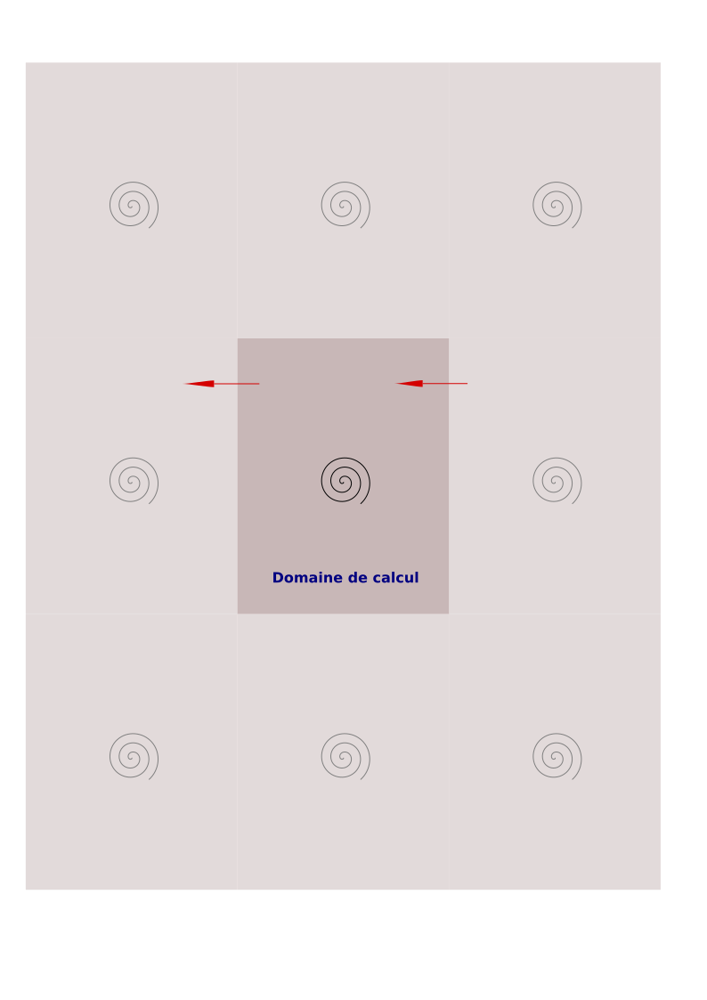

# Projet Ensta 2023
## Modélisation de tourbillons sur un tore en deux dimensions

Le projet consiste à optimiser et paralléliser un code simulant des tourbillons sur un tore en deux dimensions.

Un article ["vortical flow"](doc/vortical_flow1.pdf), en particulier le premier chapitre, décrit l'équation décrivant les vitesses générées par un tourbillon. Un tourbillon est décrit par deux paramètres :

- La coordonnée du centre du tourbillon
- L'intensité du tourbillon. Notons que si l'intensité est une valeur positive, le tourbillon tourne dans le sens direct, et si sa valeur est négative, le tourbillon tourne dans le sens indirect.

Le vecteur vitesse $v$ généré en un point $p$ par un tourbillon de centre $c$ et d'intensité $K$ est :

- Tangentiel au cercle de centre $c$ et de rayon $\vec{r}=\vec{cp}$, soit de direction $\vec{d} = \left( -r_{y}; r_{x} \right)^{T}$
- et de module $\|v\| = \frac{|K|}{\|\vec{r}\|}$

On a donc $\vec{v} = \frac{K}{\|\vec{r}\|^{2}}*\vec{d}$.

Le tore est un rectangle dont les côtés opposés sont reliés. Cela revient à considérer le domaine comme *cyclique* ce qui implique qu'on devrait gèrer une infinité de tourbillons dans l'absolu. Cependant, il 
est important de noter que les vitesses générées ont un module en $\frac{1}{\|\vec{r}\|}$, si bien qu'il suffit pour une bonne approximation de ne gèrer que les tourbillons se trouvant dans les domaines adjacents comme illustré à la [figure 1](#fig1).

Ainsi, si un tourbillon est décrit dans la simulation, le champ de vitesse prend en fait en compte neuf tourbillons pour prendre en compte la topologie en tore du domaine de calcul.

|  |
|:--:|
| <b>Figure 1 : Équivalent calcul de la gestion du tore</b>|

Pour ceux curieux en mathématiques :

- Le schéma en temps utilisé est un schéma de Runge-Kutta d'ordre cinq explicite. Il offre une grande précision en temps mais devient instable pour des pas de temps supérieurs à 1.4. Pour chaque particule (et tourbillon si mobile) on doit effectuer trois estimations du déplacement par particule pour trouver l'interpolation d'ordre cinq à effectuer.
- Le calcul du déplacement des particules utilise le champ de vitesse calculé sur une grille cartésienne (et affiché dans la partie gauche de la fenêtre) en faisant une interpolation bi-cubique par rapport aux champs de vitesse voisins de la particule.

## Compilation du code

Installer la dépendance à la bibliothèque graphique utilisée :

    sudo apt install libsfml-dev

Compiler :

    make all

## Utilisation du code

L'exécutable attend trois paramètres :

- Le nom d'un fichier décrivant une simulation à exécuter
- La résolution de l'écran de visualisation (en nombre de pixels par direction, soit deux entiers)

Exemple :

    ./vortexSimulation data/simpleSimulation.dat 1280 1024

Plusieurs fichiers décrivant diverses simulations sont donnés dans le répertoire **data** :

 - **oneVortexSimulation.dat** : Simule un seul tourbillon placé au centre du domaine de calcul et immobile (il ne se déplace pas). Utile pour tester un cas simple en parallèle en testant uniquement le déplacement des particules (le champ de vitesse reste lui aussi statique);
 - **simpleSimulation.dat** : Simule deux tourbillons contra-rotatifs et mobiles. Utile pour tester un cas simple en parallèle avec un champ de vitesse instationnaire;
 - **cornertest.dat** : Simule un unique tourbillon stationnaire centré dans le coin inférieur droit du domaine de calcul. Les particules sont concentrées au départ dans une petite zone du domaine afin de tester facilement la périodicité du domaine de calcul;
 - **triplevortex.dat** : Simule trois tourbillons dont un contra-rotatif par rapport aux deux autres. Les tourbillons sont mobiles.
 - **manyvortices.dat** : Simule cinq tourbillons mobiles dont un seul est contra-rotatif et centré par rapport aux quatre autres. Par symétrie, le tourbillon central bien que normalement mobile restera immobile par compensation des diverses vitesses générées par les quatre autres tourbillons.

Il vous est parfaitement possible de créer vos propres fichiers de simulation. Des commentaires accompagnent ces fichiers afin que vous puissiez vous même en définir de nouveaux.

Au début de la simulation, la fenêtre affiche l'état initial du champ de vitesse à gauche de l'écran et la position initiale des particules à droite de l'écran. La simulation n'avance pas en temps jusqu'à ce que vous appuyiez sur une des touches suivantes :

- *flèche droite* : Avance d'un pas de temps
- *flèche haut*   : multiplie par deux le pas de temps. **Attention** cependant, le schéma en temps utilisé est un schéma explicite, si bien que de trop gros pas de temps rend le schéma instable et la simulation devient irréaliste !
- *flèche bas*    : Divise par deux le pas de temps. Plus le pas de temps est petit, plus la simulation en temps est précise. Par contre, la simulation d'un intervalle de temps donné sera en proportion du pas de temps choisi !
- *touche P* : Les pas de temps s'incrémentent automatiquement à chaque rafraichissement de la fenêtre ;
- *touche S* : Arrête l'incrément automatique du pas de temps.

Pour quitter le programme, il faut tout simplement fermer la fenêtre !

## Parallélisation du code

### Séparation interface-graphique et calcul

Dans un premier temps, on cherchera à séparer l'interface graphique du calcul proprement dit.

On entend par interface-graphique :

- L'affichage à l'écran
- La gestion des événements (claviers et fermeture de la fenêtre).

Le calcul concerne quant à lui le calcul du champ de vitesse et le déplacement des particules (et des tourbillons si ceux-ci sont mobiles).

Remarquons que ces calculs ne sont nécessaires que si on avance en temps.
Il faudra donc que le(s) processus effectuant les calculs puisse(nt) savoir si un calcul est nécessaire ou non. Il faut donc que le processus s'occupant de l'interface graphique envoie des "ordres" aux processeurs s'occupant du calcul à chaque itération de la boucle d'événement.

On utilisera MPI comme bibliothèque pour cette partie.

### Parallélisation en mémoire partagée

On parallélisera ensuite les calculs à l'aide d'OpenMP. Bien regarder pour cela les boucles qui sont parallélisables et quelles sont les boucles prenant le plus de temps en temps de calcul.

On peut également paralléliser les boucles prenant du temps dans l'affichage. Cela n'aura un intérêt que si l'affichage et le calcul se font sur des ordinateurs différents. Essayez de tester si possible avec les ordinateurs de l'école (si possible ?).

Mesurez l'accélération obtenue localement sur un ordinateur et si possible en utilisant deux ordinateurs.

### Parallélisation en mémoire distribuée et partagée des calculs

Nous allons faire une distribution équilibrée des particules parmis les processus ayant pour tâche le calcul. Paralléliser ensuite à l'aide de MPI le calcul du déplacement des particules.

### Réflexions sur l'approche mixte Eulérienne--Lagrangienne

Enfin, dans un dernier temps, on souhaiterait également paralléliser en MPI le calcul du champ de vitesse par une approche par sous-domaine (en plus de la parallélisation du déplacement des particules déjà effectuée).

Proposer sur papier une ou plusieurs stratégies pour cette parallélisation en soulevant les problèmes que posent la parallélisation par sous-domaine (approche eulérienne) conjointe à la parallélisation du déplacement des particules (approche lagrangienne).

- Que se passe-t'il dans le cas d'un maillage de très grande dimension avec la ou les solutions que vous proposez ?
- Que se passe-t'il dans le cas d'un très grand nombre de particules ?
- Et dans le cas d'un maillage de très grande taille **ET** un très grand nombre de particules ?
